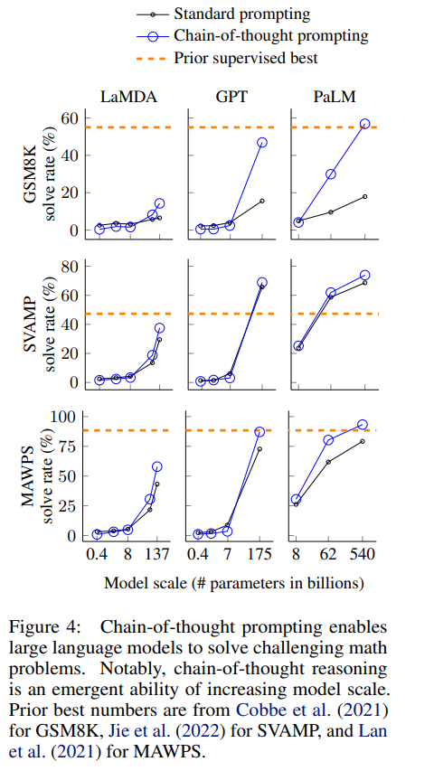

## Overview

[文章出处在这里](https://lilianweng.github.io/posts/2023-06-23-agent/)

LLM powered autonomous agents: *planning + memeoy + tool use*
一些测试文字

## 1. planning

[Chain of thought](https://arxiv.org/abs/2201.11903):

### 想法

prior work A: 可以通过产生用自然语言表达的中间步骤使得LLM获得更好的推理能力, techniques for arithmetic reasoning can benefit  from generating natural language rationales that lead to the final answer。

缺点: 要想训练具有良好推理能力的大模型(或者fine-tune a pretrained model), 需要大量的高质量推理数据集, 成本太高, 远远超过简单的input-output pairs。

prior work B: 大模型已经可以通过prompt工程获得出色的少样本学习能力, large language models offer the exciting prospect of in-context few-shot learning via prompting. That is, instead of finetuning a separate language model checkpoint for each new task, one can simply “prompt” the model with a few
input–output exemplars demonstrating the task

缺点: 使用传统的少样本学习方法，大模型在推理能力上的表现不佳。而且随着模型参数量的提升，推理能力没有明显的提升。

本文的idea：结合A和B的优点，同时避免缺点, 通过少样本的prompt使大模型获得推理能力,具体来说: 给出一个prompt: <输入, 思维链(CoT, chain-of-thought), 输出>, 其中思维链(CoT)是一系列由自然语言表示的中间过程。 这个方法被称为思维链提示工程(CoT, chain-of-thought prompting)。

### 思维链提示过程 (chain of thought prompting)

CoT prompting 对于语言模型获得推理能力有重要意义，主要是它有若干特性:

a. 步骤分解，原则上，这意味着每一步都可以使用额外的计算过程。

b. 可解释性强，每一步都可以用自然语言表示，容易debug (但是，fully characterizing a model’s computations that support an answer remains an open question)。

c. 应用范围广，CoT可以应用于math word problems, common sense reasoning, symbolic manipulation，甚至是所有能用自然语言表述的问题。

d. 使用简单，只需要一个prompt，而不是一个大的训练集。

### 实验过程

略去...

### 结果

通过构建thought-action-observation-thought... 这样的思维链，可以使得模型在推理能力上有明显的提升。具体结果如下图：

thoughts:

a. CoT的效果会随着模型参数量的增加而越来越明显，对于小模型效果可能为负

b. CoT更加适应复杂问题，对于简单问题，CoT的效果可能不如直接使用standard prompt

c. 在GPT-3 175B和PaLM 540B上实验可以在三个数据集上达到SoTA，在另外两个数据集上效果与SoTA相当(相差2%以内)。

[Tree of Thoughts](https://arxiv.org/abs/2305.10601)

### 想法1

a.

b.

[ReAct,e.g. reason-action](https://arxiv.org/abs/2210.03629):
